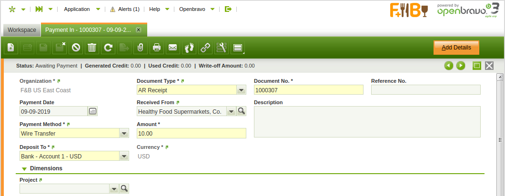
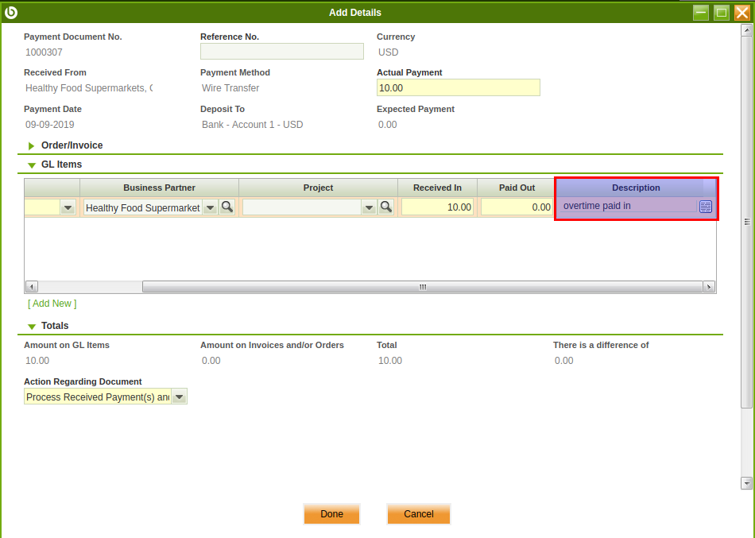
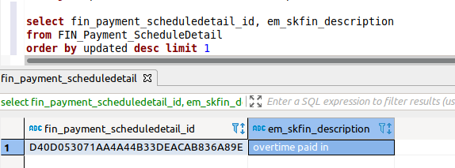
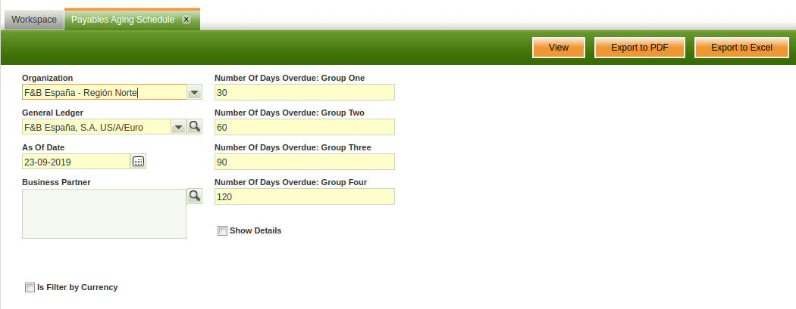

# Welcome to SKFin

SKFin is an Openbravo ERP module aim to enhances APRM module to allow 2 things:
1. add free text description on payment in/out when details come from GL Item.
2. allow AR/AP aging report to be filtered by certain currency, and not convert it's report to accounting schema currency, instead it's produce an aging payment report based on invoice currency.


# Installation
Apply core (and non-SKFin module artefact ) modification:
1. merge files inside srcClient/src into <openbravo_source>/src
2. merge files inside srcClient/modules into <openbravo_source>/modules
3. install org.sksoft.skfin.template.obx using Openbravo's UI. Follow this article for more information on how to install a module: [http://wiki.openbravo.com/wiki/Modules_Management](http://wiki.openbravo.com/wiki/Modules_Management)

# Usage

## Add description in payment in/out line when using GL Item
1. Create new payment in/out header.
2. Click **Add Details** button on top right corner.
3. Go to GL Item section, add new line, put some text on descrition field.
4. Click **Done** button in the bottom to save this form.
The record saved to database. To see the effect, you need to use SQL client (e.g PgAdmin/DBEaver) to query Openbravo database. Run sql query below:

    ```sql
    select fin_payment_scheduledetail_id, em_skfin_description
    from FIN_Payment_ScheduleDetail
    order by updated desc limit 1
    ```
    you will get this result:
    
    you can process this data further, e.g display it in the jrxml report.

## AR/AP Aging Report filtered by currency
1. open menu **Payable Aging Schedule** report.
2. thick **Is Filter By Currency** checkbox, then fill **Filter By Currency** using desired currency. Change general legder option if required.
3. Click **View** button on the top right. Your report will be shown.
4. Your report now available, you can see this report is filtered by given currency, all invoice counted in this report filtered for that particular currency.
5. Click one of business partner on the report to drill down the report. In this case, you will get detailed aging report, again filtered by given currency.
6. You can play arround with Receivable Aging Schedule report, export to PDF/Excel, etc.

